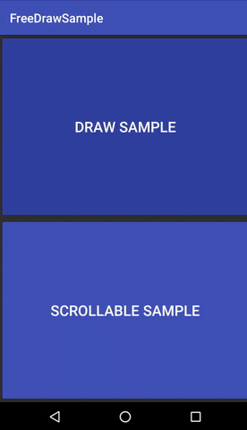
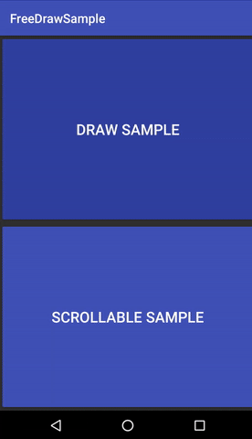
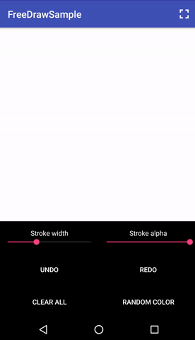

FreeDrawView
======

 <br />
A View that let you draw freely on it. You can customize paint width, alpha and color. Can be useful for notes app, signatures or hands-free writing<br /><br />
 <br />
This View works flawlessly inside Scrolling parents like NestedScrollView. Be careful with lists, you need to restore manually the draw state!<br /><br />
 <br />
Also supports state-restore on rotation, with custom behaviours like "clear, crop or fitXY" and you can take a screenshot (given to you as a Bitmap Object) of the View drawn content<br />

[Changelog](CHANGELOG.md)<br />

You can try the demo app on google play store. <br />
coming soon <br /> <br />
Or see the full video demo on YouTube. <br />
https://youtu.be/ejEdq4lnPjc <br /> <br />

Download
------
#### Gradle:
```groovy
compile 'com.rm:freedrawview:1.1.2'
```

<br />
<b>Min SDK version: 9 (Android 2.3) </b>
<br />

## Usage

To use this library, just add this inside your layout file

```xml
    <com.rm.freedrawview.FreeDrawView
                    android:id="@+id/your_id"
                    android:layout_width="match_parent"
                    android:layout_height="match_parent"
                    android:background="@color/white"

                    app:paintAlpha="255"
                    app:paintColor="@color/black"
                    app:paintWidth="4dp"
                    app:resizeBehaviour="crop"/>
```

... if you need to use this View's custom xml attributes (shown in a table below or in the example above) do not forget to add this to your root layout
```
xmlns:app="http://schemas.android.com/apk/res-auto"
```

And this in your Activity
```java
public class MainActivity extends AppCompatActivity {
    FreeDrawView mSignatureView;

    @Override
    protected void onCreate(Bundle savedInstanceState) {
        super.onCreate(savedInstanceState);
        setContentView(R.layout.activity_main);

        mSignatureView = (FreeDrawView) findViewById(R.id.your_id);

        // Setup the View
        mSignatureView.setPaintColor(Color.BLACK);
        mSignatureView.setPaintWidthPx(getResources.getDimensionPixelSize(R.dimen.paint_width));
        //mSignatureView.setPaintWidthPx(12);
        mSignatureView.setPaintWidthDp(getResources.getDimension(R.dimen.paint_width));
        //mSignatureView.setPaintWidthDp(6);
        mSignatureView.setPaintAlpha(255);// from 0 to 255
        mSignatureView.setResizeBehaviour(ResizeBehaviour.CROP);// Must be one of ResizeBehaviour
                                                                // values;

        // This listener will be notified every time the path done and undone count changes
        mSignatureView.setPathRedoUndoCountChangeListener(new PathRedoUndoCountChangeListener() {
                                  @Override
                                  public void onUndoCountChanged(int undoCount) {
                                      // The undoCount is the number of the paths that can be undone
                                  }

                                  @Override
                                  public void onRedoCountChanged(int redoCount) {
                                      // The redoCount is the number of path removed that can be redrawn
                                  }
                              });
        // This listener will be notified every time a new path has been drawn
        mSignatureView.setOnPathDrawnListener(new PathDrawnListener() {
                    @Override
                    public void onNewPathDrawn() {
                        // The user has finished drawing a path
                    }

                    @Override
                    public void onPathStart() {
                        // The user has started drawing a path
                    }
                });

        // This will take a screenshot of the current drawn content of the view
        mSignatureView.getDrawScreenshot(new FreeDrawView.DrawCreatorListener() {
                                  @Override
                                  public void onDrawCreated(Bitmap draw) {
                                      // The draw Bitmap is the drawn content of the View
                                  }

                                  @Override
                                  public void onDrawCreationError() {
                                      // Something went wrong creating the bitmap, should never
                                      // happen unless the async task has been canceled
                                  }
                              });
    }
}
```

#### Save and restore manually the Draw content
From v1.1.0 you can get the current state of the Draw (as a Serializable object) and than restore it:
```java
        FreeDrawSerializableState state = mSignatureView.getCurrentViewStateAsSerializable();// This returns a FreeDrawSerializableState (which implements Serializable)

        // Save this "state" object into a file or keep it where you want

        mSignatureView.restoreStateFromSerializable(state);// Restore the state of the view

        // Now all the previous paths and points have been restored (including the history)
```

To save this Serializable Object inside a file you can take a look at the class [FileHelper](app/src/main/java/com/rm/freedrawsample/FileHelper.java)

<br />

#### Supported Attributes
FreeDrawView
------
| XML Attribute                 | Java method                                                     	| Description                                                                                                     	| Default value                                      	                                        |
|-------------------------	    |-----------------------------------------------------------------	|-----------------------------------------------------------------------------------------------------------------	|---------------------------------------------------------------------------------------------  |
| paintColor                  	| setPaintColor(@ColorInt int checked)                              | Set the color of the paint                                                                                      	| Color.BLACK                                              	                                    |
| paintWidth                  	| setPaintWidthPx(@FloatRange(from = 0) float widthPx)              | Set the width of the paint in pixels 	                                                                            | 4dp                                               	                                        |
|                       	    | setPaintWidthDp(float dp)                                        	| Set the width of the paint in dp                                                                                  | 4dp                                                	                                        |
| paintAlpha            	    | setPaintAlpha(@IntRange(from = 0, to = 255) int alpha)            | Set the alpha of the paint                                                                                       	| 255                                                	                                        |
| resizeBehaviour        	    | setResizeBehaviour(ResizeBehaviour newBehaviour)                	| The behaviour of the view every time it is resized (on rotation for example) one of [clear, fitXY, crop]          | ResizeBehaviour.CROP                          	                                            |

<br />

#### Limitations and TODO
* Multitouch drawing is currently not supported <br />
* Eraser is not yet implemented <br />
* ~~Manually restore state is not supported~~ <br />
* Get the draw screenshot from a FreeDrawSerializableState without adding the view

<br />

Also, the FreeDrawView class gives some utility methods to handle path history: <br />
* ```public void undoLast()``` <br />
    This method undo the last drawn segment <br /> <br />
* ```public void redoLast()``` <br />
    This method redraw the last undone segment  <br /> <br />
* ```public void undoAll()``` <br />
    This method undo all the drawn segments, they can be redone one by one or all in one <br /> <br />
* ```public void redoAll()``` <br />
    This method redraw all the undone segments <br /> <br />
* ```public void clearHistory()``` <br />
    This method removes all the history segments (The one that could be redone) <br /> <br />
* ```public void clearDraw()``` <br />
    This method removes all the current drawn segments, without adding them to the history <br /> <br />
* ```public void clearDrawAndHistory()``` <br />
    This method removes all the current drawn segments and clears the history <br /> <br />
* ```public int getPathCount(boolean includeCurrentlyDrawingPath)``` <br />
    This method returns the current number of segments drawn <br /> <br />


<br />

You can use: <br/>
* ```setOnPathDrawnListener(PathDrawnListener listener)``` <br />
to be notified every time the user starts or finishes drawing a line. <br /> <br />
* ```setPathRedoUndoCountChangeListener(PathRedoUndoCountChangeListener listener)``` <br />
to be notified when the undo or redo count changes. <br /> <br />

And remove them with: <br/>
* ```removePathDrawnListener()``` <br />
* ```removePathRedoUndoCountChangeListener()``` <br />
<br />

License
--------

    Copyright 2017 Riccardo Moro.

    Licensed under the Apache License, Version 2.0 (the "License");
    you may not use this file except in compliance with the License.
    You may obtain a copy of the License at

       http://www.apache.org/licenses/LICENSE-2.0

    Unless required by applicable law or agreed to in writing, software
    distributed under the License is distributed on an "AS IS" BASIS,
    WITHOUT WARRANTIES OR CONDITIONS OF ANY KIND, either express or implied.
    See the License for the specific language governing permissions and
    limitations under the License.
